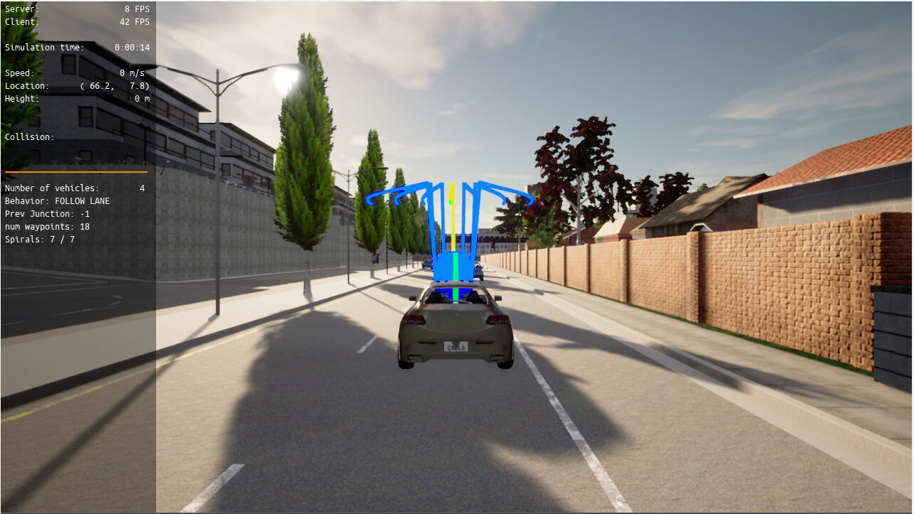
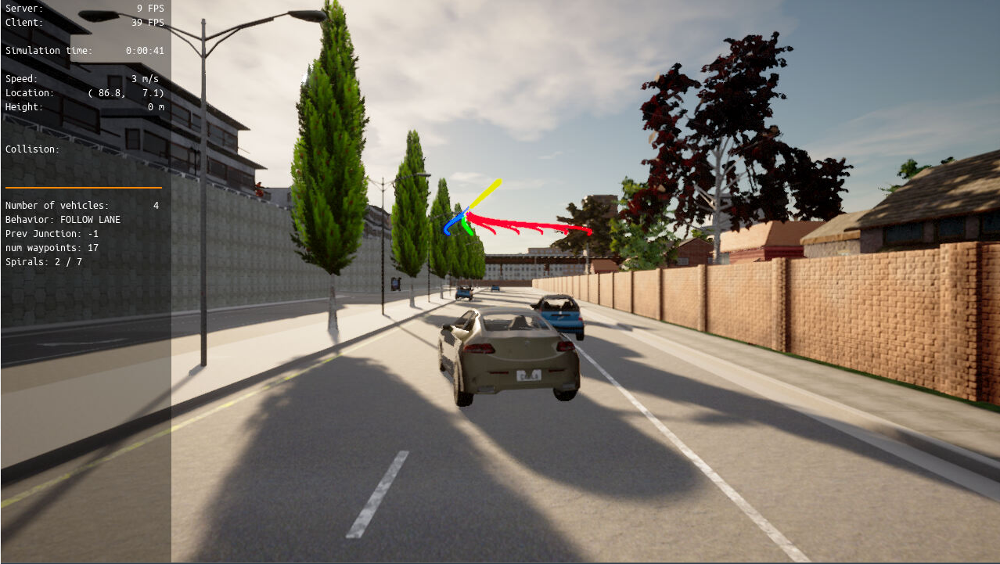
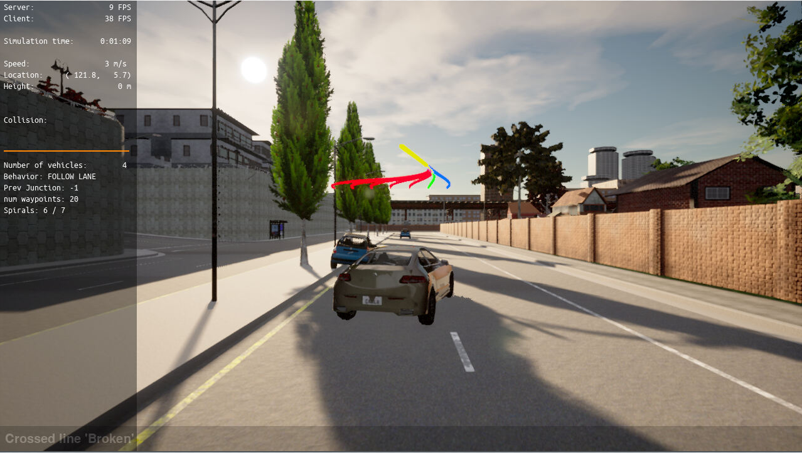
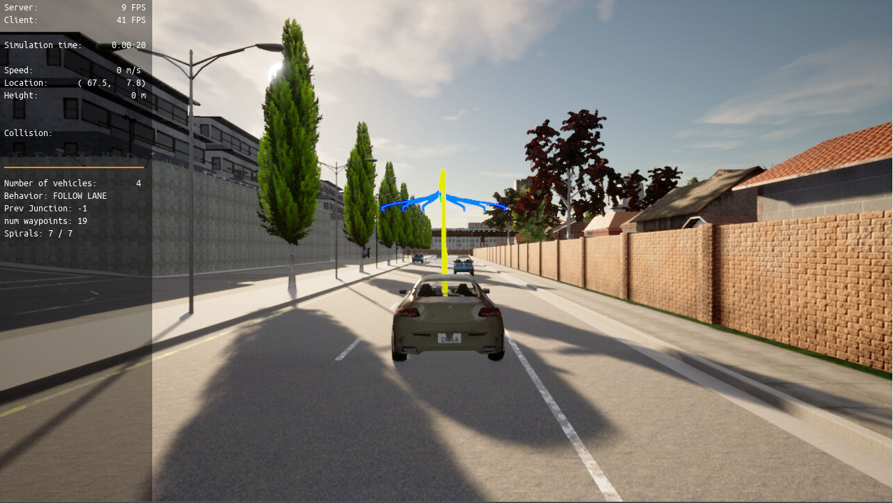
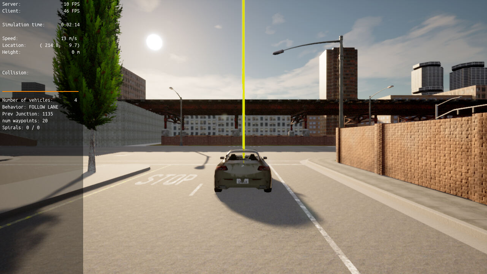

# Motion Planning and Decision Making for Autonomous Vehicles
This is the project for the forth course in the  [Udacity Self-Driving Car Engineer Nanodegree Program](https://github.com/udacity/nd013-c5-planning-starter.git)

## License
[License](LICENSE.md)

# Project Overview
In this project, two main components of a traditional hierarchical planner are implemented in which help on the following aspects:
- Avoid static objects (cars, bicycles and trucks) parked on the side of the road (but still invading the lane). The vehicle must avoid crashing with these vehicles by executing either a “nudge” or a “lane change” maneuver.
- Handle any type of intersection (3-way, 4-way intersections and roundabouts) by STOPPING in all of them (by default)
- Track the centerline on the traveling lane.

# Implementation
- Behavioral planning logic using Finite State Machines - FSM
- Static objects collision checking.
- Path and trajectory generation using cubic spirals
- Best trajectory selection though a cost function evaluation. This cost function will mainly perform a collision check and a proximity check to bring cost higher as we get closer or collide with objects but maintaining a bias to stay closer to the lane center line.

All of the implementations are done in Udacity workspace by using the CARLA stimulator and pygame engine.

# Usage
All the running steps are written in the [how_to_run.txt](project/how_to_run.txt)

After cmake file, by using the following files (replaced), make the file and follow the running stimulation steps. These are the important files that needs to complete the project:
1. [behavior_planner_FSM.cpp](code/behavior_planner_FSM.cpp)
2. [cost_functions.cpp](code/cost_functions.cpp)
3. [motion_planner.cpp](code/motion_planner.cpp)
4. [velocity_profile_generator.cpp](code/velocity_profile_generator.cpp)
5. [planning_params.h](code/planning_params.h)

# Demonstration
These are few pictures showing in the full [video](https://youtu.be/I-BYNxyNgKQ)

## Car is Ready and Target The Lane (Start Scene)

## Car Changes Lane when Detecting Car on The Right Side

## Car Changes Lane when Detecting Car on The Left Side

## Car Stay on The Lane

## Car Stops (End Scene)

# Conclusion
This project is showing how the motion planning and decision making on the autonomous driving system. Although in the stimulator, it seems the driving system can avoid all the obstacles and drive safely, but there are still a lot of aspects needed to be considered such as in real-time moving vehicles, pedestrians and extreme weather. 
